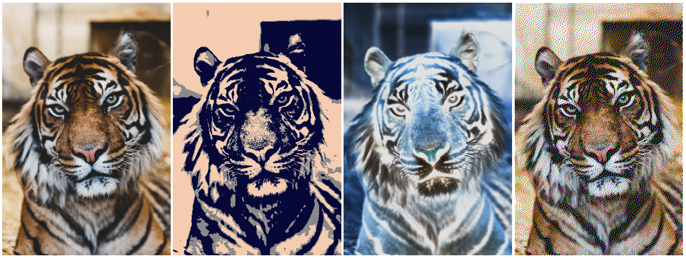

I'm messing around with the pixel data of images using javascript.  
  
Add your image path to the src property in the image tag, then press the button to see the output.  
  
I've noticed that chrome doesn't like to play nice with this, but you can add outside links by adding  
the link to the src property in the image tag.  
Chrome is okay with you doing that, but becomes upset if the photo is on your machine.  

This is the output that can be expected:  
  
  
The image on the far right is my attempt at using the Floyd-Steinberg Dithering algorithm, which can be found on [wikipedia](https://en.wikipedia.org/wiki/Floyd%E2%80%93Steinberg_dithering)

Photo of the tiger by Ian Robinson can also be found [here](https://unsplash.com/photos/DfKZs6DOrw4).
